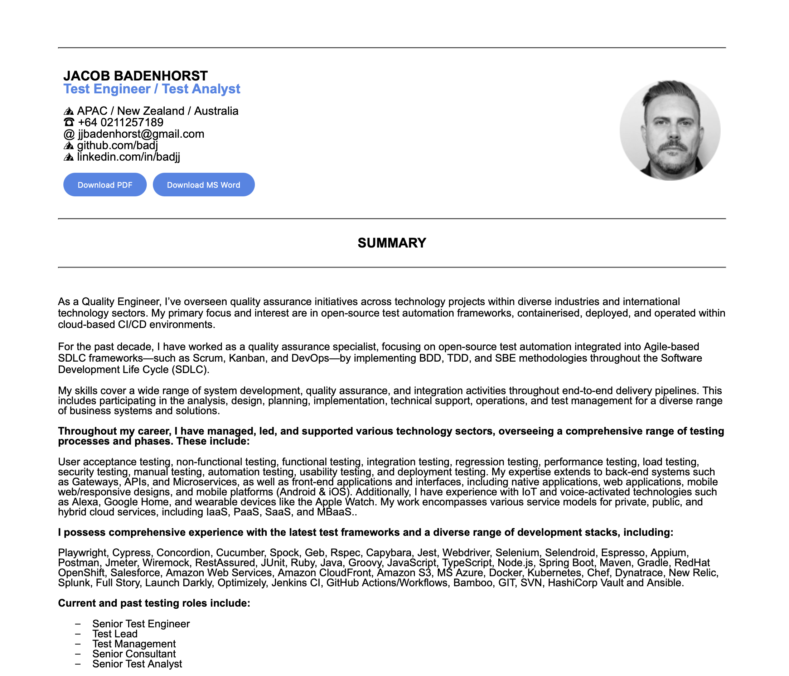

# Online Resume hosted with GitHub Pages 

## Overview

This project is a [personal online resume](https://badj.github.io/online-resume/) hosted with GitHub Pages. The HTML resume can be downloaded in PDF or MS Word doc formats.

[](https://github.com/badj/Online-Resume/actions/workflows/pages/pages-build-deployment)

**Resume sample**



***

### Table of contents

- [Features](#features)
- [Folder Structure](#folder-structure)
- [TODO](#todo)
***

## Features

- [GitHub hosted resume HTML page](https://badj.github.io/online-resume/)
- Downloadable resume in [**PDF**](https://github.com/badj/online-resume/raw/refs/heads/main/download/JJ_BADENHORST_CV_2025_with_photo.pdf) and [**MS Word docx**](https://github.com/badj/online-resume/raw/refs/heads/main/download/JJ_BADENHORST_CV_2025_with_photo.docx) formats.

***

## Folder Structure

```terminaloutput
├── download/  # Folder containing downloadable resume files
├── images/    # Folder containing header headshot image used in HTML resume and page preview for Readme
├── index.html # GitHub hosted resume HTML page
```

***

## TODO

1. Tweak the header section to make the unused whitespace less prominent.
2. Update the contact information in header to be rendered in the same font size as the content - currently rendering smaller on mobile devices.
3. Update résumé content: Less wording and simplify to decrease pages.

***
